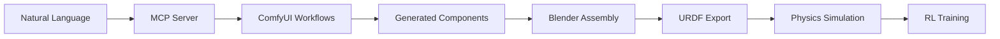

# ComfyUI MCP Server

> **Forked from [overseer66/comfyui-mcp-server](https://github.com/overseer66/comfyui-mcp-server)**  
> Enhanced for generative robotics, Blender integration, and URDF export workflows.

A modern MCP (Model Context Protocol) server that bridges ComfyUI with robotics design tools, featuring Blender integration for generative robotics and URDF export capabilities.

## 🎯 Vision: Language-as-Code for Generative Robotics



Transform natural language descriptions into functional robot designs ready for simulation and training.

## ✨ Features

### Core MCP Server
- **4 Built-in Tools**: `text_to_image`, `download_image`, `run_workflow_from_file`, `run_workflow_from_json`
- **Flexible Transport**: stdio, WebSocket, and SSE support
- **Environment Configuration**: `.env` file support with authentication
- **Docker Ready**: Multi-platform deployment options

### 🆕 Modernization Enhancements
- **UV Package Manager**: Fast, modern Python dependency management
- **Comprehensive Testing**: Unit and integration tests with pytest
- **Optional Dependencies**: Modular installation for different use cases
- **Code Quality**: Black, ruff, mypy configuration
- **Development Tools**: Enhanced debugging and testing workflows

### 🤖 Robotics & Blender Integration
- **Blender Addon**: Full UI integration for robot design
- **URDF Export**: Export robot assemblies for physics simulation
- **Joint Definitions**: Define kinematic relationships visually
- **Component Generation**: Generate robot parts from natural language
- **Physics Validation**: Basic simulation readiness checks

## 🚀 Quick Start

### Prerequisites
- **Python 3.12+**
- **UV** package manager ([install uv](https://docs.astral.sh/uv/getting-started/installation/))
- **ComfyUI** server running on localhost:8188
- **Blender 4.0+** (for robotics features)

### Installation

```bash
# Clone the repository
git clone https://github.com/elasticdotventures/comfyui-mcp-server.git
cd comfyui-mcp-server

# Install with UV (recommended)
uv sync

# Or install with specific feature sets
uv sync --extra robotics     # For robotics tools
uv sync --extra blender      # For Blender integration  
uv sync --extra simulation   # For physics simulation
uv sync --extra all          # Everything included
```

### Configuration

Create `src/.env` file:

```env
# ComfyUI server settings
COMFYUI_HOST=localhost
COMFYUI_PORT=8188

# Optional: Authentication
# COMFYUI_AUTHENTICATION="Bearer your_token"

# Return format (true=URL, false=binary data)
RETURN_URL=true

# MCP transport (stdio, sse)
MCP_TRANSPORT=stdio

# Workflow directory
WORKFLOW_DIR=workflows
```

### Running the Server

```bash
# Development mode
uv run src/server.py

# With MCP CLI
uv run mcp dev src/server.py

# Production with docker
docker build -t comfyui-mcp .
docker run -p 3000:3000 comfyui-mcp
```

## 🔧 Development

### Testing

```bash
# Run all tests
uv run pytest

# Unit tests only
uv run pytest tests/unit/ -v

# Integration tests (requires ComfyUI server)
uv run pytest tests/integration/ -v

# Skip integration tests
SKIP_INTEGRATION=true uv run pytest

# Test with coverage
uv run pytest --cov=src tests/
```

### Code Quality

```bash
# Format code
uv run black src/ tests/

# Lint code  
uv run ruff check src/ tests/

# Type checking
uv run mypy src/
```

### ComfyUI Integration Testing

```bash
# Test ComfyUI connectivity
uv run python src/test_comfyui.py

# Debug MCP server
uv run mcp dev src/server.py
```

## 🎮 Built-in MCP Tools

### `text_to_image`
Generate images using ComfyUI workflows.

```python
{
  "prompt": "robot arm joint with mounting holes",
  "seed": 42,
  "steps": 20,
  "cfg": 8.0,
  "denoise": 1.0
}
```

### `download_image`
Download generated images to local storage.

```python
{
  "url": "http://localhost:8188/view?filename=image.png",
  "save_path": "/path/to/save/image.png"
}
```

### `run_workflow_from_file`
Execute ComfyUI workflows from JSON files.

```python
{
  "file_path": "workflows/custom_workflow.json"
}
```

### `run_workflow_from_json`
Execute workflows from inline JSON data.

```python
{
  "3": {
    "inputs": {"seed": 42, "steps": 20},
    "class_type": "KSampler"
  }
}
```

## 🤖 Blender Robotics Addon

### Installation

```bash
# Package addon
cd blender_addon
zip -r comfyui_mcp.zip comfyui_mcp/

# Install in Blender
# Edit → Preferences → Add-ons → Install → Select comfyui_mcp.zip
```

### Features

- **MCP Server Connection**: Connect to running MCP server
- **Component Generation**: Generate robot parts with natural language
- **Joint Definition**: Define kinematic relationships visually
- **URDF Export**: Export complete robot assemblies
- **Physics Validation**: Check simulation readiness

### Workflow

1. **Connect**: Link Blender to MCP server
2. **Generate**: Create robot components using AI
3. **Assemble**: Define joints and constraints
4. **Export**: Generate URDF for simulation

## 🐳 Docker Deployment

### Standard Deployment

```bash
# Build image
docker build -t elasticdotventures/comfyui-mcp .

# Run with stdio transport
docker run -i --rm elasticdotventures/comfyui-mcp

# Run with port mapping
docker run -i --rm -p 3001:3000 elasticdotventures/comfyui-mcp
```

### SSE Transport

```bash
# Run SSE server
docker run -i --rm -p 8001:8000 elasticdotventures/comfyui-mcp-sse

# Configure in mcp.json
{
  "mcpServers": {
    "comfyui": {
      "url": "http://localhost:8001/sse"
    }
  }
}
```

## 📊 MCP Configuration

### Claude Desktop (`mcp.json`)

```json
{
  "mcpServers": {
    "comfyui": {
      "command": "uv",
      "args": [
        "--directory", "/path/to/comfyui-mcp-server",
        "run", "src/server.py"
      ],
      "env": {
        "COMFYUI_HOST": "localhost",
        "COMFYUI_PORT": "8188"
      }
    }
  }
}
```

### VS Code / Cursor

```json
{
  "mcpServers": {
    "comfyui": {
      "command": "uv",
      "args": [
        "--directory", "/path/to/comfyui-mcp-server", 
        "run", "--with", "mcp[cli]",
        "mcp", "run", "src/server.py:mcp"
      ]
    }
  }
}
```

## 🔄 Robotics Pipeline Integration

### Gymnasium/MuJoCo Workflow

```python
# 1. Generate in Blender → Export URDF
robot.urdf

# 2. Load in MuJoCo
import mujoco
model = mujoco.MjModel.from_xml_path("robot.urdf")

# 3. Create Gymnasium environment  
import gymnasium as gym
env = gym.make("YourRobot-v1", model=model)

# 4. Train with RL
from stable_baselines3 import PPO
model = PPO("MlpPolicy", env).learn(1000000)
```

### Physics Simulation Stack

- **MuJoCo**: High-fidelity physics simulation
- **Gymnasium**: Standard RL environment API  
- **Stable-Baselines3**: RL algorithm implementations
- **MuBlE**: Blender + MuJoCo integration (experimental)

## 🧪 Advanced Usage

### Custom Workflows

1. Export workflow from ComfyUI (API format)
2. Place in `workflows/` directory  
3. Reference in MCP tools:

```python
# Custom workflow
await run_workflow_from_file("workflows/my_robot_generator.json")
```

### Extending the Server

```python
# Add new MCP tool
@mcp.tool()
async def generate_robot_assembly(components: list) -> dict:
    """Compose multiple components into robot assembly."""
    # Your implementation
    return result
```

### Blender Scripting

```python
# Generate component programmatically
import bpy
bpy.ops.comfyui.generate_component()

# Export URDF  
bpy.ops.comfyui.export_urdf(filepath="/path/to/robot.urdf")
```

## 📁 Project Structure

```
comfyui-mcp-server/
├── src/                        # MCP server source
│   ├── server.py              # Main MCP server
│   ├── client/                # ComfyUI client
│   ├── test_comfyui.py       # Integration tests
│   └── .env                   # Configuration
├── tests/                      # Test suite
│   ├── unit/                  # Unit tests
│   └── integration/           # Integration tests
├── blender_addon/             # Blender robotics addon
│   └── comfyui_mcp/          # Addon source
├── workflows/                 # ComfyUI workflows
├── docker/                    # Docker configurations
├── pyproject.toml            # UV configuration
└── README.md                 # This file
```

## 🤝 Contributing

1. **Fork** the repository
2. **Create** feature branch: `git checkout -b feature/amazing-feature`
3. **Test** your changes: `uv run pytest`
4. **Commit** changes: `git commit -m 'Add amazing feature'`
5. **Push** to branch: `git push origin feature/amazing-feature`
6. **Open** Pull Request

### Development Setup

```bash
# Clone your fork
git clone https://github.com/yourusername/comfyui-mcp-server.git

# Install development dependencies
uv sync --extra dev

# Install pre-commit hooks
uv run pre-commit install

# Run tests
uv run pytest
```

## 🐛 Troubleshooting

### Common Issues

**Connection Failed**
- Check ComfyUI server is running on specified port
- Verify firewall settings for WebSocket connections
- Ensure `.env` configuration is correct

**Generation Errors**
- Check ComfyUI workflow files exist in `workflows/`
- Verify ComfyUI models are loaded and accessible
- Check ComfyUI server logs for detailed errors

**Blender Integration**
- Ensure Blender 4.0+ is installed
- Check addon is enabled in Blender preferences
- Verify MCP server is running and accessible

### Debug Mode

```bash
# Enable debug logging
DEBUG=1 uv run src/server.py

# Test ComfyUI connection
uv run python src/test_comfyui.py

# Validate URDF exports
python -c "import urdfpy; urdfpy.URDF.load('robot.urdf')"
```

## 📄 License

Apache License 2.0 - see [LICENSE](LICENSE) file for details.

## 🙏 Acknowledgments

- [overseer66](https://github.com/overseer66) - Original ComfyUI MCP server implementation
- [ComfyUI](https://github.com/comfyanonymous/ComfyUI) - Stable Diffusion GUI
- [Anthropic](https://anthropic.com) - Model Context Protocol specification
- [Blender Foundation](https://blender.org) - Open source 3D creation suite

## 🔗 Related Projects

- [blend-my-bot](https://pypi.org/project/blend-my-bot/) - URDF import for Blender
- [MuBlE](https://github.com/michaal94/MuBlE) - Blender + MuJoCo integration
- [Gymnasium](https://gymnasium.farama.org/) - RL environment standard
- [MuJoCo](https://mujoco.org/) - Physics simulation engine

---

**🎯 Ready to build the future of generative robotics?**

Start with `uv sync && uv run src/server.py` and begin generating robot components with natural language!